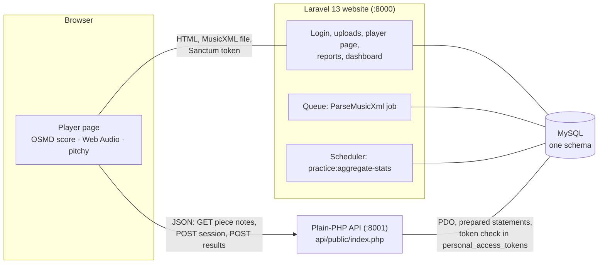

# Pitchwise — developer README

A tuner and a score follower in one. The browser shows a MusicXML score, moves a cursor at the chosen tempo, listens through the microphone and shows **live** whether the current note is in tune, too high or too low. Each note gets a verdict, each page a summary, and each run a stored report. A dashboard tracks progress and per-note intonation.

It copies Tomplay's shape on a small scale: a **Laravel** website and a **plain-PHP API** sharing one **MySQL** database; real-time audio stays in the browser.

> For musicians who just want to use it: see [README-for-musicians.md](README-for-musicians.md).

## Architecture



- **Laravel owns the schema** (migrations) and issues a short-lived Sanctum token (ability `practice:write`, 3 h) when the player page loads.
- **The API has no framework.** Composer autoload, PDO, three routes. It validates the Sanctum token itself by reading `personal_access_tokens` (`"42|secret"` → row 42, `sha256(secret)`), checks every submitted `expected_midi` against `piece_notes`, **re-judges every note on the server** from the heard frequency, and inserts each batch in one transaction.
- **Audio never leaves the browser.** Only one frequency + clarity per note is sent.

| Layer | Where |
|---|---|
| Controllers → Services → Repositories → Eloquent | `app/Http/Controllers`, `app/Services`, `app/Repositories`, `app/Models` |
| Validation / access | `app/Http/Requests/StorePieceRequest.php`, `app/Policies/*` |
| MusicXML → expected notes (XMLReader, streaming) | `app/Services/MusicXml/MusicXmlParser.php`, queued by `app/Jobs/ParseMusicXml.php` |
| Per-pitch statistics | `app/Services/PitchStatsAggregator.php`, command `practice:aggregate-stats`, scheduled in `routes/console.php` |
| Plain-PHP API | `api/public/index.php` (front controller), `api/src/*` (namespace `PracticeApi\`) |
| Pitch rule (PHP) | `api/src/Verdict.php` |
| Browser player | `resources/js/player.js` + `resources/js/practice/*` |
| Pitch rule (JS) | `resources/js/practice/pitch-math.js` — same rule as `Verdict.php`, both tested against `tests/fixtures/verdict-cases.json` |

Stack as built: PHP 8.3, Laravel 13.34, Breeze 2 (Blade), Sanctum 4, PHPUnit 12, OpenSheetMusicDisplay 2.2, pitchy 4.1, Chart.js 4.5, Vite 8, Tailwind 3.

## Run it locally

Requirements: PHP ≥ 8.3 with `pdo_mysql` (or `pdo_sqlite`), `xmlreader`, `zip`; Composer; Node 20+; MySQL 8 (or SQLite for a quick try).

```bash
composer install            # no composer.lock is shipped (see below); this resolves and writes one
cp .env.example .env
php artisan key:generate
```

Database — MySQL (as in the playbook) in `.env`:

```dotenv
DB_CONNECTION=mysql
DB_HOST=127.0.0.1
DB_PORT=3306
DB_DATABASE=pitchwise
DB_USERNAME=root
DB_PASSWORD=
```

…or keep `DB_CONNECTION=sqlite` and `touch database/database.sqlite` for a zero-setup run. Both the website and the API read the same `.env`.

```bash
php artisan migrate --seed  # demo user demo@example.com / password, 3 catalogue pieces, 14 fake runs
npm install
npm run build               # or `npm run dev` while working on the JS
```

Then four processes (four terminals, or Laravel Sail / Herd if you prefer):

```bash
php artisan serve                        # website   http://localhost:8000
composer serve-api                       # API       http://127.0.0.1:8001/api/v1
php artisan queue:work                   # parses uploaded MusicXML
php artisan schedule:work                # rolls finished runs into the dashboard stats every 5 min
```

Open http://localhost:8000, log in as the demo user, **Pieces → ▶ Practise**. The browser asks for the microphone; that only works on `https://` or `localhost`.

Relevant `.env` keys (all in `.env.example`):

| Key | Default | Meaning |
|---|---|---|
| `PRACTICE_API_URL` | `http://localhost:8001/api/v1` | where the browser calls the API |
| `PRACTICE_WEB_ORIGINS` | `APP_URL` | origins allowed by the API's CORS check, comma-separated |
| `PRACTICE_TOLERANCE_MODE` | `cents` | default pitch rule, `cents` or `hz` |
| `PRACTICE_TOLERANCE_VALUE` | `30` | its width |
| `PRACTICE_REFERENCE_HZ` | `440` | default concert A |

In production, serve the API from the same host under `/api/v1` (an nginx `location /api/v1` pointing at `api/public/index.php`), set `PRACTICE_API_URL=/api/v1`, and CORS stops mattering.

### Why there is no composer.lock

This first version was built in a sandbox without Packagist or npm access; PHP packages were mirrored from GitHub tags. That lock file pointed at local paths, so it was removed. Run `composer install` once and commit the `composer.lock` it writes; same for `package-lock.json` after `npm install`.

## The pitch rule

```
expected Hz = A · 2^((midi − 69) / 12)        A = concert pitch, 440 by default
cents       = 1200 · log2(heard Hz / expected Hz)
```

| Verdict | Rule |
|---|---|
| `in_tune` | within the tolerance: **±30 cents** by default; a setting, in cents or in Hz |
| `sharp` / `flat` | outside the tolerance, up to ±50 cents |
| `wrong_note` | more than 50 cents away (closer to a neighbouring note) |
| `missed` | fewer than 2 frames with clarity ≥ 0.9 in the note's listening window |

The in-tune check runs first. In **Hz mode** that means a fixed window: ±30 Hz is −288/+247 cents on the open G (G3, 196 Hz) but −40/+39 cents at E6 (1319 Hz), so on low strings a neighbouring note counts as in tune. That is why cents is the default; the player says so next to the setting, and each run stores the rule it used (`practice_sessions.tolerance_mode`, `tolerance_value`, `reference_hz`) so old runs keep their meaning.

The playbook first had the wrong-note boundary at 100 cents. A clean semitone slip (B♭ for A, exactly 100 cents) then came out as "too high", so it is 50 here. Change `WRONG_NOTE_CENTS` in both `Verdict.php` and `pitch-math.js` together; the shared fixture test will tell you if they disagree.

## How a run works (browser)

1. `GET /api/v1/pieces/{id}` returns the expected notes (server-parsed: onset and duration in quarter-note beats). OSMD renders the same MusicXML and `ScoreView.buildNoteMap()` walks its cursor once to find the matching noteheads and their page. If the two counts differ the player warns; scoring is unaffected, only colouring.
2. **Start** opens the microphone with echo cancellation, noise suppression and auto gain **off** (they bend pitch), posts `POST /sessions`, and schedules a one-bar count-in as clicks on the `AudioContext` clock.
3. Every animation frame: read 2048 samples from an `AnalyserNode`, run pitchy (McLeod pitch method) → `{hz, clarity}`.
   - The cursor follows the **written** time (`timeline.js`).
   - Each note is listened to in the middle 60 % of its length, shifted by the *input delay* setting (default 80 ms).
   - The dial compares the median of the last 3 clear frames to the note being heard now.
4. When a note's window closes: median of its clear frames → `judge()` → notehead coloured.
5. At the end of each page, and at the end: `POST /sessions/{id}/results` with that batch (`finished: true` on the last). The server's verdicts replace the browser's if they ever differ. The end-of-run panel shows the score, per-page table, bars to practise and the notes furthest off; the saved report is `/sessions/{id}`.

## API reference

All routes need `Authorization: Bearer <id>|<token>` with ability `practice:write`. POSTs need `Content-Type: application/json`. Errors are `{"error": {"code", "message", "details"?}}`.

| Method + path | Body | Success | Notable errors |
|---|---|---|---|
| `GET /api/v1/pieces/{id}` | – | `200` piece + `notes[]` (`note_index`, `measure`, `midi_pitch`, `onset_beats`, `duration_beats`) | `404` not yours / not catalogue, `409 not_ready` |
| `POST /api/v1/sessions` | `piece_id`, `bpm` (20–300), `tolerance_mode` (`cents`\|`hz`), `tolerance_value` (1–100), `reference_hz` (400–480), `latency_ms` | `201` session | `422 validation` |
| `POST /api/v1/sessions/{id}/results` | `results[]` of `{note_index, expected_midi, detected_hz\|null, clarity\|null}` (≤ 2000), `finished` | `201` server verdicts, running `counts`, `score_pct` | `422` expected pitch ≠ score (whole batch rejected), `409 duplicate`, `409 already_finished`, `404` someone else's run |

Example:

```bash
curl -s -H "Authorization: Bearer $TOKEN" -H "Content-Type: application/json" \
  -d '{"results":[{"note_index":0,"expected_midi":55,"detected_hz":196.4,"clarity":0.97}],"finished":true}' \
  http://127.0.0.1:8001/api/v1/sessions/15/results
```

Get a token for manual testing with `php artisan tinker --execute 'echo app(App\Services\PlayerTokenService::class)->issue(App\Models\User::first());'`.

## Data model

| Table | Key columns | Notes |
|---|---|---|
| `pieces` | id, owner_id (NULL = catalogue), title, composer, instrument, musicxml_path, default_bpm, beats_per_measure, note_count, parse_status | `parse_status`: pending → ready / failed |
| `piece_notes` | piece_id, note_index, measure, midi_pitch, onset_beats, duration_beats | unique (piece_id, note_index); written by the parse job |
| `practice_sessions` | user_id, piece_id, bpm, tolerance_mode, tolerance_value, reference_hz, latency_ms, started_at, finished_at, score_pct, aggregated_at | index (user_id, piece_id, finished_at), index (finished_at, aggregated_at) |
| `note_results` | session_id, note_index, expected_midi, detected_midi, detected_hz, cents_offset, verdict ENUM, clarity | unique (session_id, note_index) |
| `user_pitch_stats` | user_id, midi_pitch, attempts, in_tune, avg_cents | unique (user_id, midi_pitch); rebuilt per user by the aggregator (idempotent) |

Additions to the playbook's first data model: `onset_beats` (the browser needs note positions, and rests take time), the per-run pitch rule columns, `detected_hz` (so the server can judge), `beats_per_measure` (count-in), `parse_status`, and nullable `owner_id` for the shared catalogue.

Which notes count — the parser and the browser's note map use the same rules: first part, lowest voice, pitched notes, first written note of a chord, no grace or cue notes, tied continuations merged, repeats and numbered endings expanded, plus D.C./D.S./Fine/coda jumps, beats = quarter notes.

## Tests

```bash
php artisan test     # 54 tests: parser edge cases, verdict fixture, uploads + policies, player token,
                     # report, aggregation, dashboard, and the plain-PHP API in-process on Laravel's DB connection
npm test             # 14 tests: verdict fixture (same file as PHP), timeline, report,
                     # and pitchy on synthetic bowed tones with vibrato (needs npm install)
vendor/bin/pint      # code style
```

The API tests build `PracticeApi\App` with `DB::connection()->getPdo()` and Sanctum tokens issued by Laravel, so they exercise exactly the two-systems-one-database contract.

## The EXPLAIN exercise (milestone 3)

```bash
php artisan db:seed --class=LoadTestSeeder                    # ~30,000 runs ≈ 1 million note_results
LOADTEST_SESSIONS=3000 php artisan db:seed --class=LoadTestSeeder   # smaller
php artisan practice:aggregate-stats
```

Run it on MySQL. Then `EXPLAIN` (and `EXPLAIN ANALYZE`) the queries in `app/Repositories/PracticeStatsRepository.php` and `PitchStatsAggregator::recomputeUser()`, drop and re-add the indexes in the migrations, and record before/after here:

| Query | Before: type / key / rows / Extra | After | Index that helped |
|---|---|---|---|
| score history | | | |
| trouble bars | | | |
| recompute user stats | | | |

## Known limits

- One melody line: chords, double stops and piano are out of scope. Transposing instruments and tempo changes inside a piece are not handled; pick simple pieces.
- Pitch only, not rhythm: the cursor sets the time and notes are judged in their window.
- If the browser tab is hidden, animation frames stop and notes come out as missed (the player warns).
- `autoResize` is off on the score so colours survive a run; switching layout re-renders.

## Built with AI: what to check yourself

This version was written with Claude in one session. Verified there: all PHP and JS tests above pass; the API was exercised with `curl` against a running `php -S` server; pitchy was checked on synthetic tones (open G in tune, A 40 cents sharp, E5 35 cents flat, a semitone slip, high A6, silence).

**Not verified** (no browser or microphone in that environment): the OSMD rendering, cursor movement and notehead colouring, the microphone flow, and the Vite/Tailwind build. Check these first:

1. `npm run build` passes.
2. The player loads a catalogue piece without the "melody notes" count warning.
3. On the tuner page, an open A reads about 440 Hz (or your concert A) and the needle is steady.
4. Play the open-strings exercise slowly; noteheads turn colour as you go. If verdicts seem one note late or early, adjust *Input delay*.

| What I checked by hand | Result |
|---|---|
| | |
